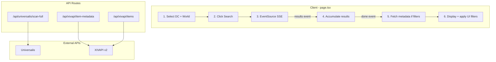

# ProfitXIV

**ProfitXIV** is a lightweight web tool to see how much items resell for on the Final Fantasy XIV market board. It displays items that sell for the highest prices, with average and last sale prices per unit. You can also compare prices across all worlds in a Data Center to find the best place to buy or sell.

The application fetches marketboard data from Universalis and displays resale values — all without storing any data in a database.

This project is built for fun and gameplay optimization.

---

## Features

- Full scan of all marketable items (6–8 minutes) with live progress
- Average sale price per unit (last 4 days)
- Last sale price per unit (with date when available)
- **Market comparison**: compare item prices across all worlds in a Data Center (cheapest, most expensive, difference %, full table)
- **Search filters** (popover): Hide non-craftable, Hide non-gatherable, Min avg sale price, Min sales/day, Min last sale
- **Anti-money-transfer**: automatic exclusion of items with abnormal prices (sales > 50× normal price)
- **Cancel search**: clickable button during scan (double-click to confirm)
- **Craft simulator**: recipe tree with costs, available even after cancel (metadata fetched on demand)
- **Item icons**: displayed in the table and dialogs
- **About dialog**: GitHub link + Discord (Info button in header)
- Sort by average sale price or sales per day
- Trace dialog: step-by-step logic for each item (verify in-game)
- Real-time market data from Universalis
- Item names and icons from XIVAPI
- No database, client-driven

---

## Item search flow



**Step-by-step:**

1. **Selection**: User selects a Data Center and World (via `/api/universalis/regions`).
2. **Launch**: Click Search → confirmation via ScanAlertDialog → EventSource opens to `/api/universalis/scan-full?world=...&dataCenter=...`.
3. **Universalis scan** (server-side):
   - Fetch marketable IDs + tax rate
   - Loop by batch of 100 items: `getAggregated(world, batchIds)`
   - For each item: minPrice, avgSalePrice, lastSalePrice, dailyVelocity
   - Server filters: profit > 0, velocity >= 0.5, **anti-transfer** (lastSale/avgSale or avgSale/minPrice < 50×)
   - Send SSE `results` event per batch
4. **Client accumulation**: Results are merged (best profit per item), sorted, top 100.
5. **Metadata** (if Hide non-craftable or Hide non-gatherable): call `/api/xivapi/item-metadata?ids=...` → craftableIds, gatherableIds, recipeMap. Filter via `shouldDisplayItem`.
6. **Display**: Fetch names/icons via `/api/xivapi/items`, apply UI filters (min avg, min velocity, min last sale), sort by column.

---

## Tech Stack

- Next.js 16
- TypeScript
- Tailwind CSS
- shadcn/ui (Radix UI)
- [Universalis API](https://docs.universalis.app/) v2
- [XIVAPI](https://xivapi.com/) v2 (item names, icons, craftable check, recipe tree)
- sonner (toasts)
- cross-env (NODE_OPTIONS)

---

## Project structure

```
app/
  page.tsx              # Main page
  api/
    universalis/        # scan-full, trace, compare-markets, regions
    xivapi/             # items, item-metadata, recipe-tree
components/             # Header, TraceDialog, CompareDialog, CraftSimDialog, etc.
lib/                    # universalis, xivapi, api-client, search-filters
```

---

## Getting Started

```bash
npm install
npm run dev
```

Then open [http://localhost:3000](http://localhost:3000)

### Scripts

- `npm run dev` — development server
- `npm run build` — production build
- `npm run start` — production server
- `npm run test:item-icon` — test item icon retrieval

---

## Disclaimer

This project is a tool created for gameplay optimization and experimentation.  
All data belongs to their respective sources and APIs.

---

## License

This project is licensed under the GNU Affero General Public License v3.0 (AGPLv3).

You are free to use, modify, and distribute this software, but you must:
- Give appropriate credit
- Disclose source code if you run a modified version publicly
- Keep the same license

See the [LICENSE](./LICENSE.md) file for full details.
