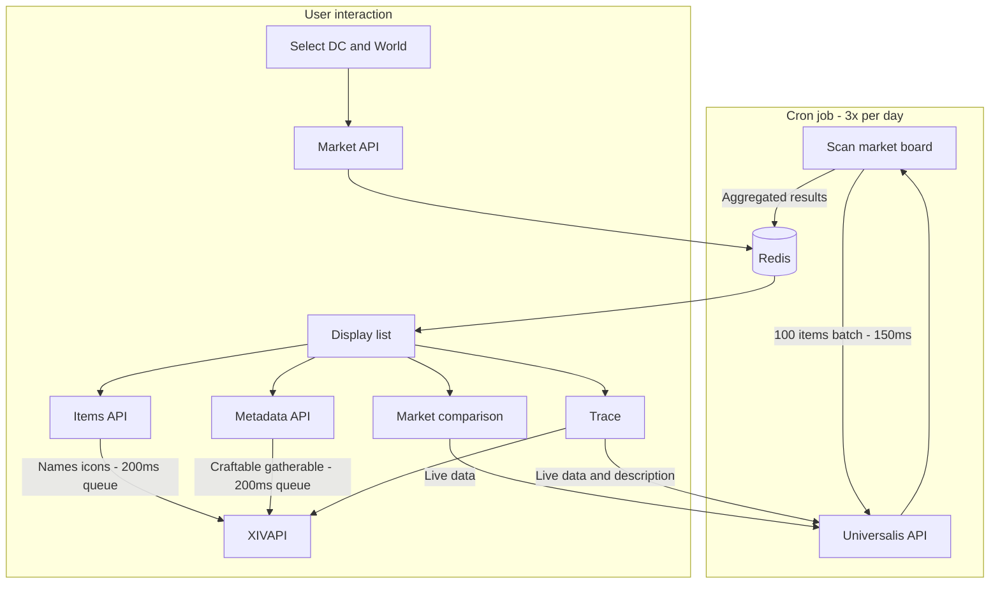

# ProfitXIV

**ProfitXIV** is a lightweight web tool to see how much items resell for on the Final Fantasy XIV market board. It displays items that sell for the highest prices, with average and last sale prices per unit. You can also compare prices across all worlds in a Data Center to find the best place to buy or sell.

The application fetches marketboard data from Universalis and displays resale values — all without storing any data in a database.

This project is built for fun and gameplay optimization.

---

## Features

- Full scan of all marketable items (6–8 minutes) with live progress
- Average sale price per unit (last 4 days)
- Last sale price per unit (with date when available)
- **Market comparison**: compare item prices across all worlds in a Data Center (cheapest, most expensive, difference %, full table)
- Filter by craftable items only (XIVAPI recipe check)
- Sort by average sale price or sales per day
- Trace dialog: step-by-step logic for each item (verify in-game)
- Real-time market data from Universalis
- Item names from XIVAPI
- No database, client-driven

---

## How it works




1. A background cron job periodically scans all marketable items from Universalis and stores aggregated results in Redis (3× per day). Between each batch of 100 items, the scan waits **150 ms** before the next Universalis request. XIVAPI calls (names, icons, metadata) pass through a global queue with **200 ms** between requests (~5 req/s) and use a **1000 ms** backoff on rate limit (429).
2. User selects a Data Center and a World.
3. The app loads the latest cached snapshot for that Data Center from `/api/market` (no long-running client-side scan).
4. For each item: average sale price per unit, last sale price per unit (with date when available), daily velocity and net profit are precomputed during the scan.
5. Optional: filter out non-craftable / non-gatherable items via XIVAPI metadata.
6. Results are sorted by profit by default; you can sort by average sale price or sales/day.
7. **Market comparison** (chart icon): opens a modal to compare prices across all worlds in the selected Data Center (live Universalis data).
8. **Trace dialog** (info icon): shows step-by-step data for a specific world to verify prices and calculations.

---

## Tech Stack

- Next.js 16
- TypeScript
- Tailwind CSS
- shadcn/ui (Radix UI)
- [Universalis API](https://docs.universalis.app/) (market data)
- [XIVAPI](https://xivapi.com/) (item names, craftable check, item metadata)
- Redis (caching)
- Vercel (hosting)

---

## Getting Started

```bash
npm install
npm run dev
```

Then open [http://localhost:3000](http://localhost:3000)

### Scripts

- `npm run dev` — development server
- `npm run build` — production build
- `npm run start` — production server

---

## Disclaimer

This project is a tool created for gameplay optimization and experimentation.  
All data belongs to their respective sources and APIs.

---

## License

This project is licensed under the GNU Affero General Public License v3.0 (AGPLv3).

You are free to use, modify, and distribute this software, but you must:

- Give appropriate credit
- Disclose source code if you run a modified version publicly
- Keep the same license

See the [LICENSE](./LICENSE.md) file for full details.